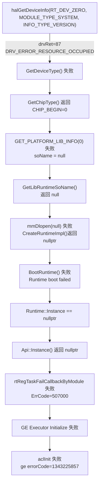
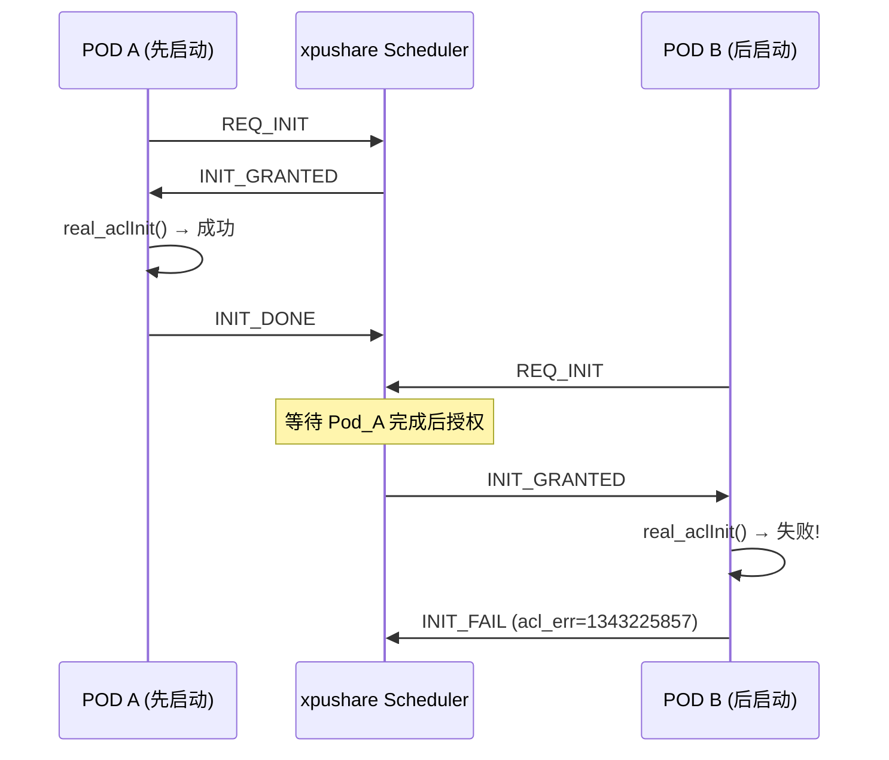
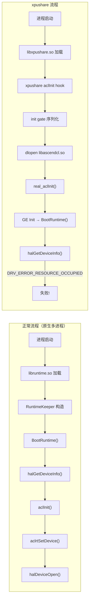
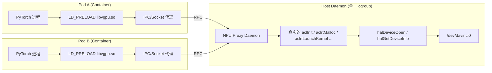
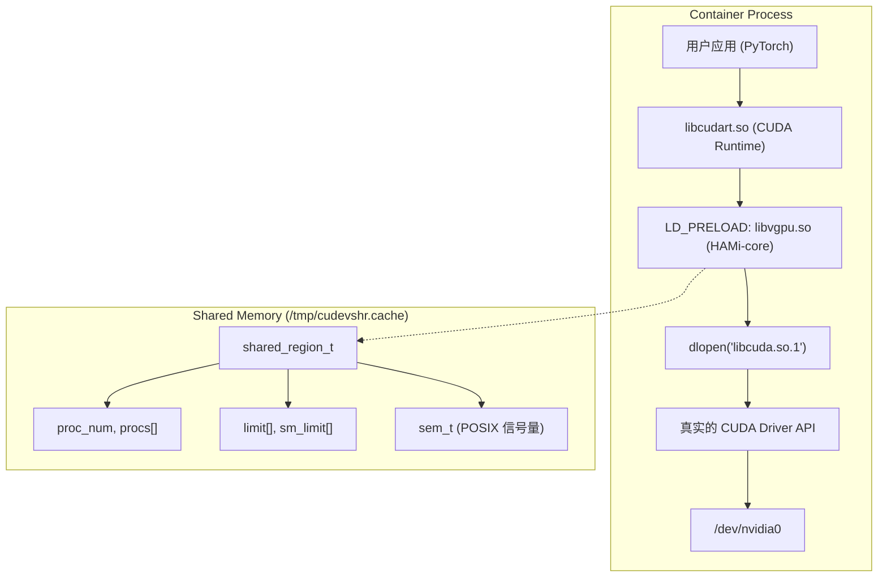

# NPU 双 POD 并发初始化失败根因分析

## 1. 问题描述

**现象**：两个 POD 被调度到同一张 NPU 卡上时，其中一个 POD 中的 PyTorch 任务在 `aclInit` 阶段报错。

**关键对比**：在同一个 NPU 单卡 POD 中并发启动两个 PyTorch 进程，可以正常执行完成，说明 NPU 单卡原生支持多进程并发。因此问题出在 xpushare 对 CANN 的拦截实现上。

**最终错误**：`aclInit` 返回错误码 `507000`（`ErrCode=507000`），对应 `ACL_ERROR_RT_INTERNAL_ERROR`。

---

## 2. 错误调用链路追踪

根据日志中的调用路径，逆向分析完整错误链如下：

```
aclInit (acl.cpp:308)
  └─ GE Executor Initialize (ge_executor.cc:310)
      └─ RegErrorTrackingCallBack (error_tracking.cc:121)
          └─ rtRegTaskFailCallbackByModule (api_c.cc:2108)
              └─ Api::Instance() → Runtime::Instance == nullptr (api.cc:15)
                  └─ RuntimeKeeper::BootRuntime() 失败 (runtime_keeper.cc:239)
                      └─ CreateRuntimeImpl() 返回 nullptr (runtime_keeper.cc:156)
                          └─ GetLibRuntimeSoName() 返回 "(null)" (runtime_keeper.cc:142)
                              └─ GetChipType() 返回 chipType=0 (runtime_keeper.cc:129)
                                  └─ GetDeviceType() 失败 (runtime_keeper.cc:64)
                                      └─ halGetDeviceInfo() 返回 drvRet=87 (runtime_keeper.cc:47)
```

### 2.1 根本错误：`drvRet=87` → `DRV_ERROR_RESOURCE_OCCUPIED`

查看 CANN 驱动错误码定义（[ascend_hal_error.h](file:///Users/luogangyi/Code/cann/runtime/include/driver/ascend_hal_error.h#L115)）：

```c
DRV_ERROR_RESOURCE_OCCUPIED = 87,   // 资源已被占用
```

系统提示信息也佐证了这一点：

```
EL0005: The resources are busy.
Possible Cause: 1. The resources have been occupied.
                2. The device is being reset.
                3. Software is not ready.
```

### 2.2 完整错误级联



---

## 3. CANN Runtime 初始化机制分析

### 3.1 RuntimeKeeper 静态全局单例

在 [runtime_keeper.cc](file:///Users/luogangyi/Code/cann/runtime/src/runtime/feature/src/plugin_manage/runtime_keeper.cc) 中：

```cpp
static RuntimeKeeper g_runtimeKeeper;  // 全局静态对象

Runtime *RuntimeKeeperGetRuntime() {
    return (g_runtimeKeeper.BootRuntime());
}
```

`g_runtimeKeeper` 是一个 **全局静态对象**，其构造函数在 `libruntime.so` 加载时执行。`BootRuntime()` 使用 CAS 保证只有一个线程执行初始化：

```cpp
RuntimeKeeper::BootRuntime() {
    if (bootStage_.CompareExchange(BOOT_INIT, BOOT_ON)) {
        // 第一次进入：获取芯片类型并加载对应的 runtime SO
        runtime_ = CreateRuntimeImpl(&handle);
        // ...
    } else {
        // 后续进入：等待初始化完成
        while ((tmpValue != BOOT_DONE) && (tmpValue != BOOT_INIT)) { ... }
    }
}
```

### 3.2 `halGetDeviceInfo` 的调用时机

`halGetDeviceInfo` 被以下路径触发：

1. **`RuntimeKeeper::BootRuntime()`** → `CreateRuntimeImpl()` → `GetLibRuntimeSoName()` → `GetChipType()` → `GetDeviceType()` → `halGetDeviceInfo(RT_DEV_ZERO, ...)`
2. **`Runtime::Init()`** → `InitChipAndSocType()` → `CheckHaveDevice()` → `halGetDeviceInfo(RT_DEV_ZERO, ...)`

这两个路径都使用 **`RT_DEV_ZERO`（设备索引 0）** 来查询设备信息。

### 3.3 设备打开流程

在设备初始化时，CANN 通过 `halDeviceOpen()` 打开设备（[npu_driver.cc](file:///Users/luogangyi/Code/cann/runtime/src/runtime/feature/src/drv/npu_driver.cc#L2924-L2987)）。这是一个进程级的 ioctl 调用，内核驱动会为每个进程分配独立的设备上下文。

---

## 4. xpushare 拦截机制分析

### 4.1 ACL Hook 架构

xpushare 通过 `LD_PRELOAD` 机制拦截 ACL API。在 [hook.c](file:///Users/luogangyi/Code/xpushare/src/hook.c) 中：

```c
// 通过 dlopen 加载真实的 libascendcl.so 并获取函数指针
static void bootstrap_acl(void) {
    acl_handle = dlopen("libascendcl.so", RTLD_LAZY);
    LOAD_ACL_SYM(aclInit);
    // ...
}
```

### 4.2 Init Gate 序列化机制

xpushare 的 NPU init gate（[client.c](file:///Users/luogangyi/Code/xpushare/src/client.c#L197-L281)）通过 scheduler 序列化 `aclInit` 调用：



### 4.3 aclInit Hook 实现

```c
aclError aclInit(const char* configPath) {
    // 1. 选择 NPU 后端
    maybe_select_backend(XPUSHARE_BACKEND_NPU, "aclInit");

    // 2. 初始化 xpushare 库和客户端连接
    pthread_once(&init_libxpushare_done, initialize_libxpushare);
    pthread_once(&init_done, initialize_client);

    // 3. 请求 init gate 授权（通过 scheduler 序列化）
    should_init = begin_npu_init_gate("aclInit");

    // 4. 调用真实的 aclInit（带重试机制）
    ret = call_real_aclinit_with_retry(configPath);
    // ...
}
```

重试机制（[hook.c:599-621](file:///Users/luogangyi/Code/xpushare/src/hook.c#L599-L621)）最多重试 16 次，间隔递增（50ms×次数），但只对 `507000`、`0x50100001` 和 `ACL_ERROR_RT_CONTEXT_NULL` 等瞬态错误进行重试。

---

## 5. 根因分析

### 5.1 核心问题：`DRV_ERROR_RESOURCE_OCCUPIED` 的来源

错误 87 (`DRV_ERROR_RESOURCE_OCCUPIED`) 来自内核驱动的 `halGetDeviceInfo` 调用。当两个容器化进程共享同一张 NPU 卡时，驱动层认为设备资源已被另一个进程占用。

### 5.2 为什么原生多进程不报错

在 **不使用 xpushare** 的原生场景中，每个进程独立完成以下流程：

1. 进程加载 `libascendcl.so` → 触发 `RuntimeKeeper` 全局构造 → `BootRuntime()` → `halGetDeviceInfo()` 成功（设备空闲或驱动支持并发查询）
2. 进程调用 `aclInit()` → `aclrtSetDevice()` → `halDeviceOpen()` → 内核为进程分配独立的设备上下文

关键：**两个进程的 `halGetDeviceInfo` 调用不会冲突**，因为 `halGetDeviceInfo` 是一个只读查询操作，内核驱动允许多个进程并发调用。

### 5.3 为什么 xpushare 下会报错

> [!CAUTION]
> 以下是关键推理——xpushare 改变了 CANN runtime 的加载和初始化时序。

在 xpushare 场景下，两个 POD 进程都通过 `LD_PRELOAD=libxpushare.so` 启动。xpushare 的 hook 机制导致了以下问题：

#### 问题场景重现

**正常流程（不使用 xpushare）**：
```
进程启动 → 动态链接器加载 libascendcl.so → 
libascendcl.so 加载 libruntime.so →
RuntimeKeeper 全局构造 → BootRuntime() → halGetDeviceInfo() → 成功
→ aclInit() → 正常
```

**xpushare 流程**：
```
进程启动 → LD_PRELOAD 加载 libxpushare.so（导出 aclInit 符号）→
PyTorch 调用 aclInit() → 进入 xpushare 的 aclInit hook →
hook 内调用 bootstrap_acl() → dlopen("libascendcl.so", RTLD_LAZY) →
hook 内调用 real_aclInit(configPath) →
                   ↓
     [在 real_aclInit 内部首次触发 GE Executor 初始化]
     [GE Executor 调用 runtime API → 触发 RuntimeKeeper::BootRuntime()]
     [BootRuntime() 调用 halGetDeviceInfo(RT_DEV_ZERO, ...)]
                   ↓
     此时竞争发生：如果 Pod A 正在执行 halDeviceOpen / Runtime 初始化
     而 Pod B 的 halGetDeviceInfo 查询同一设备 → DRV_ERROR_RESOURCE_OCCUPIED
```

#### 关键差异分析

1. **`dlopen` 时机不同**：xpushare 使用 `dlopen("libascendcl.so", RTLD_LAZY)` 获取函数指针，而不是正常的动态链接。这意味着 `libascendcl.so` 的内部依赖库（包括 `libruntime.so`）的加载和初始化时机与原生场景不同。

2. **Init Gate 序列化不完全**：xpushare 的 init gate 只序列化了 `aclInit()` 调用本身。但问题是，在 `real_aclInit` 内部执行时，GE Executor 初始化会调用 runtime API，而 runtime 的 `BootRuntime()` 会调用 `halGetDeviceInfo`。虽然 init gate 保证了两个 POD 的 `aclInit` 不会并发执行，但以下时间窗口仍然存在竞争：

   - **Pod A 执行 `real_aclInit()`**：GE 初始化 → runtime `BootRuntime()` → `halDeviceOpen()` 打开设备 → 设备处于"正在初始化"状态
   - **Pod B 收到 `INIT_GRANTED`**：开始执行 `real_aclInit()` → GE 初始化 → runtime `BootRuntime()` → `halGetDeviceInfo()` 查询设备 → **设备资源仍被 Pod A 的初始化流程占用** → `DRV_ERROR_RESOURCE_OCCUPIED`

3. **`aclInit` 内部的全局状态残留**：xpushare 的 init gate 在 Pod A 的 `aclInit` 成功后标记 `npu_init_gate_mark_deferred()`，延迟释放 gate 直到 `aclrtSetDevice`。但对于 **Pod B（独立进程，独立容器）**，这个延迟逻辑并不影响它；Pod B 的问题出在**驱动层面的资源竞争**。

### 5.4 Retry 机制为什么无效

xpushare 的重试逻辑判断 `507000` 为瞬态错误（`NPU_ACLINIT_TRANSIENT_ERR_A`），会重试 16 次：

```c
#define NPU_ACLINIT_RETRY_TIMES 16
#define NPU_ACLINIT_RETRY_SLEEP_US 50000  // 50ms 递增

for (attempt = 1; attempt <= NPU_ACLINIT_RETRY_TIMES; ++attempt) {
    usleep(NPU_ACLINIT_RETRY_SLEEP_US * attempt);  // 最大等~13.6s
    ret = real_aclInit(configPath);
    // ...
}
```

从日志时间戳看，`aclInit` 重试持续了约 11 秒（16:36:40 → 16:36:51），但每次重试都触发完整的 `BootRuntime()` → `halGetDeviceInfo()` 失败链路。

**重试无效的原因**：`DRV_ERROR_RESOURCE_OCCUPIED` 不是一个短暂的瞬态错误。只要 Pod A 的 runtime 实例持续占用设备资源、且 Pod B 的查询方式不正确（未正确 bind 到设备），这个错误就会一直持续。

---

## 6. 深层原因：CANN 驱动的设备访问模型

### 6.1 `halGetDeviceInfo` 的设备索引问题

```cpp
// runtime_keeper.cc:47 - BootRuntime 阶段
halGetDeviceInfo(RT_DEV_ZERO, MODULE_TYPE_SYSTEM, INFO_TYPE_VERSION, &hardwareVersion);
```

`RT_DEV_ZERO = 0`，这是一个**逻辑设备索引**。在容器化环境中：

- **不使用 xpushare**：Kubernetes device plugin 通过 `ASCEND_VISIBLE_DEVICES` 环境变量控制设备可见性，每个容器看到的设备 0 就是分配给它的物理设备。驱动通过进程的 cgroup 和设备文件访问权限来隔离。
- **使用 xpushare**：两个 POD 共享同一张 NPU 卡，都通过设备索引 0 访问同一个物理设备。但驱动的设备资源管理可能不允许两个不同容器（不同 PID namespace 或不同 cgroup）的进程在未经正确设备 open 的情况下并发调用 `halGetDeviceInfo`。

### 6.2 `halGetDeviceInfo` vs `halDeviceOpen` 的时序问题



关键区别：在 xpushare 场景下，**`halGetDeviceInfo` 的调用发生在进程还未正式 "open" 设备之前**。这是由 CANN runtime 的内部初始化流程决定的——`BootRuntime()` 需要先通过 `halGetDeviceInfo` 获取芯片类型来决定加载哪个 runtime SO，但此时进程可能还未通过 `halDeviceOpen` 建立与设备的正式连接。

在两个 POD 共享设备的场景下，当 Pod A 已经成功完成 `halDeviceOpen` 并持有设备资源后，Pod B 在尚未 `halDeviceOpen` 的情况下直接调用 `halGetDeviceInfo` 查询设备信息，驱动返回 "资源已被占用"。

---

## 7. 解决方案建议

### 方案 1：在 init gate 阶段增加 `halDeviceOpen` 拦截（推荐）

**思路**：在 `aclInit` 之前，确保进程已经正确打开设备，使得后续的 `halGetDeviceInfo` 能正常工作。

**具体做法**：
- 拦截 `aclrtSetDevice` 并确保它在 `aclInit` 之前或作为 `aclInit` 的一部分被调用
- 或者在 `real_aclInit()` 调用之前，主动调用一次 `halDeviceOpen()` 来建立进程与设备的连接

### 方案 2：延长 init gate 的保护范围

**思路**：将 init gate 的保护范围从仅覆盖 `aclInit` 扩展到覆盖整个设备初始化链路，包括 `aclrtSetDevice` 和第一次内存分配（`aclrtMalloc`）。

**具体做法**：
```
begin_npu_init_gate("aclInit")
  → real_aclInit()          // GE 初始化 + Runtime bootstrap
  → real_aclrtSetDevice()   // 设备绑定 + halDeviceOpen
  → [第一次 aclrtMalloc]    // 确保设备上下文完全就绪
end_npu_init_gate(1, ACL_SUCCESS)
```

**当前实现已经部分做到了这一点**（`npu_init_gate_mark_deferred` 延迟到 `aclrtSetDevice`），但 Pod B 是独立进程，不受 Pod A 的内部状态影响。

### 方案 3：增加驱动层面的 halGetDeviceInfo 重试/容错

**思路**：既然 `DRV_ERROR_RESOURCE_OCCUPIED` 在多容器场景下是预期的瞬态错误，应该在更早期的层面进行重试。

**具体做法**：
- 在 `real_aclInit` 重试时，增加更长的等待时间（当前最大约 13.6 秒可能不够）
- 或者拦截更底层的 `halGetDeviceInfo` 调用，增加重试逻辑

### 方案 4：借鉴 CANN runtime 自身的容错机制

在 [runtime_keeper.cc:44-83](file:///Users/luogangyi/Code/cann/runtime/src/runtime/feature/src/plugin_manage/runtime_keeper.cc#L44-L83) 中，`GetDeviceType()` 自身已经有回退逻辑：

```cpp
rtError_t GetDeviceType(int64_t *hwVersion) {
    drvError_t drvRet = halGetDeviceInfo(RT_DEV_ZERO, ...);  // 先尝试设备 0
    if (drvRet != DRV_ERROR_NONE) {
        // 回退：遍历所有设备
        for (uint32_t i = 0U; i < devCnt; i++) {
            drvRet = halGetDeviceInfo(i, ...);
            if (drvRet == DRV_ERROR_NONE) break;
        }
    }
}
```

但这个回退只遍历不同的设备 ID，不会解决同一设备的资源占用问题。

### 方案 5：环境变量隔离（最小改动方案）

**思路**：确保两个 POD 通过 `ASCEND_RT_VISIBLE_DEVICES` 看到的是同一个设备的不同虚拟映射。

**前提**：需要确认 CANN 驱动是否支持 Virtual Function（VF）或类似的设备虚拟化机制。如果支持，可以通过 device plugin 为每个 POD 分配同一物理设备的不同 VF ID，从而在驱动层面实现隔离。

---

## 8. 需要进一步确认的信息

1. **Pod A 的日志**：Pod A（先启动的容器）是否正常完成了 `aclInit` 和后续任务？这可以确认问题确实是单方向的。

2. **设备虚拟化配置**：当前的 NPU 设备是否开启了任何形式的虚拟化（如 VF、容器隔离模式）？运行 `npu-smi info` 查看设备配置。

3. **容器设备映射**：两个 POD 看到的 `/dev/davinci*` 设备节点是否完全相同？这影响驱动的进程隔离行为。

4. **TSD（Task Scheduler Daemon）状态**：CANN 的 TSD 是设备管理的关键组件。两个容器是否共享 TSD 进程？运行 `ps aux | grep tsd` 确认。

5. **驱动日志**：`/var/log/npu/slog/device-*` 或 `dmesg` 中是否有更详细的驱动错误信息？特别是 drvRet=87 的上下文。

6. **Init Gate 时序验证**：两个 POD 的 xpushare 日志中，`REQ_INIT` / `INIT_GRANTED` / `INIT_DONE` / `INIT_FAIL` 的时间戳，确认 init gate 序列化是否真的生效了。

---

## 9. 总结

| 维度 | 分析结果 |
|------|---------|
| **错误码** | `drvRet=87` = `DRV_ERROR_RESOURCE_OCCUPIED` |
| **失败位置** | `halGetDeviceInfo(0, MODULE_TYPE_SYSTEM, INFO_TYPE_VERSION)` |
| **级联影响** | chipType=0 → soName=null → runtime SO 加载失败 → Runtime 实例为 null → 所有 runtime API 失败 |
| **根因** | xpushare 的 init gate 序列化覆盖了 `aclInit` 调用，但 CANN runtime 的 `BootRuntime()` 中 `halGetDeviceInfo` 在驱动层面检测到设备资源被 Pod A 占用 |
| **与原生多进程的差异** | 原生多进程中，每个进程独立加载 runtime → 独立 open 设备 → 驱动为每个进程分配独立上下文；xpushare 的 `LD_PRELOAD` + `dlopen` 机制改变了加载时序 |
| **推荐方案** | 方案 2（扩展 init gate 保护范围）+ 方案 3（增加底层重试）的组合 |

---

## 10. Gemini 方案 Review 与补充意见

平行分析报告 ([npu-concurrency-analysis-gemini31.md](file:///Users/luogangyi/Code/xpushare/docs/design/npu-concurrency-analysis-gemini31.md)) 从操作系统和驱动隔离（cgroup/namespace）角度给出了深刻见解。以下是 Review 和补充意见：

### 10.1 对 Gemini 根因分析的认可

Gemini 指出 **Ascend CANN 内核驱动 (`davinci` 驱动) 实施了严格的容器级硬件隔离机制**——设备首次被打开时，驱动将其与进程的 cgroup/namespace 绑定；不同 Pod 分属不同 cgroup，Pod B 试图访问被 Pod A 占用的设备时，在内核态 ioctl 层面被拒绝，抛出 `DRV_ERROR_RESOURCE_OCCUPIED (87)`。

**结合我们的分析**：User-space 时序（`halGetDeviceInfo` 抢先于 `halDeviceOpen`）加上 Kernel-space cgroup 隔离锁定，构成了**完整的逻辑链**。仅通过延长 xpushare 的 init gate 或增加重试，**无法在两个独立 Pod 之间实现设备复用**——驱动底层拒绝了第二个 cgroup 域的接入。

### 10.2 对 Gemini 各方案的评估

#### Gemini 方案 1：vNPU (SR-IOV) [首选，合规路径]
- 华为官方支持的算力切分方案，彻底消除 cgroup 冲突。
- 取决于物理机型是否支持 vNPU / vASCEND，以及 K8s device plugin 配合。

#### Gemini 方案 2：统一 Cgroup 欺骗 [高风险]
- 理论可行，但严重破坏 K8s 原生隔离，可能导致 OOM killer 等行为异常。

#### Gemini 方案 3：Client-Server API 代理架构 (MPS) [详见下方深度分析]

#### Gemini "Hack Driver" [终极杀手锏]
- 修改 `devdrv_manager_get_container_id`、`uda_proc_can_access_udevid`、`devdrv_container_check_devid_in_container_ns` 三个函数跳过校验。
- 如果环境允许自定义编译替换内核模块，这是**最高效彻底的纯软件解法**。

---

## 11. Gemini 方案 3 深度可行性分析 & HAMi-core 对比

### 11.1 MPS 代理架构的原理

Gemini 方案 3 提出的 Client-Server API 代理架构，其核心思想是：



**关键点**：所有 GPU/NPU 操作都不在容器进程中执行，而是通过 IPC 转发到宿主机上一个单一 Daemon 进程。由于 Daemon 属于宿主机的 cgroup，它可以正常打开和操作设备，从而**从根本上绕过 cgroup 隔离问题**。

### 11.2 MPS 方案的可行性评估

| 维度 | 评估 |
|------|------|
| **绕过 cgroup 隔离** | ✅ 彻底解决。Daemon 是唯一的设备持有者，不存在跨 cgroup 问题 |
| **工程复杂度** | ❌ **极高**。需要代理 CANN 的全部关键 API（数百个函数），包括内存分配、数据拷贝、Kernel Launch、Stream/Event 管理等 |
| **性能开销** | ❌ **显著**。每次 API 调用都需要 IPC 序列化/反序列化。`aclrtMemcpy` 需要跨进程传输大块数据（GB 级），延迟不可接受 |
| **内存管理** | ❌ 设备内存指针在 Daemon 进程空间中，容器进程无法直接使用（地址空间隔离）。需要复杂的指针映射/翻译层 |
| **并发安全** | ⚠️ Daemon 需要维护多客户端的上下文/设备/流的完整生命周期，容错和并发处理复杂 |
| **故障隔离** | ❌ Daemon 崩溃导致所有客户端同时失败 |
| **现有参考** | NVIDIA MPS (Multi-Process Service) 是类似架构，但它由 NVIDIA 官方在**驱动层面**实现，而非纯用户态代理 |

> [!WARNING]
> MPS 代理架构最大的工程难点不在 API 拦截本身，而在于**设备内存指针的跨进程透传**。CANN 的 `aclrtMalloc` 返回的是设备端虚拟地址，这个地址只在调用进程的设备上下文中有效。如果由 Daemon 代理分配，容器进程拿到的指针在其自身进程空间中无意义，后续的 `aclrtMemcpy`、`aclrtLaunchKernel` 等都需要完整的指针翻译——这相当于实现了一个 NPU 版的 rCUDA / VOCL。

### 11.3 HAMi-core 架构分析

通过阅读 [HAMi-core](file:///Users/luogangyi/Code/HAMi-core) 源码，我们发现 **HAMi-core 并非 Gemini 方案 3 所述的 MPS 代理架构**，而是与 xpushare 架构完全相同的 `LD_PRELOAD` 进程内拦截方案。

#### HAMi-core 的核心架构



**关键发现**：

1. **纯进程内拦截**：HAMi-core 的 [load_cuda_libraries()](file:///Users/luogangyi/Code/HAMi-core/src/cuda/hook.c#L240-L280) 使用 `dlopen("libcuda.so.1")` + `dlsym` 获取真实的 CUDA Driver 函数指针，每个容器进程**直接调用真实的 GPU 驱动 API**。没有任何 RPC/IPC 代理 Daemon。

2. **共享内存协调**：多进程间通过 [shared_region_t](file:///Users/luogangyi/Code/HAMi-core/src/multiprocess/multiprocess_memory_limit.h#L89-L107) 结构体（映射到 `/tmp/cudevshr.cache` 文件）进行协调，使用 POSIX 信号量 (`sem_t`) 做互斥锁。协调内容包括：
   - 每个进程的显存使用量 (`used[dev].total`)
   - 每个设备的显存上限 (`limit[dev]`)
   - SM 算力配额 (`sm_limit[dev]`)
   - 进程存活状态检测 (`proc_alive`)

3. **无 NPU 支持**：HAMi-core 源码中不包含任何 CANN/ACL 相关代码，仅支持 NVIDIA CUDA。

#### HAMi-core vs xpushare 架构对比

| 维度 | HAMi-core | xpushare | Gemini 方案 3 (MPS) |
|------|-----------|---------|---------------------|
| **拦截方式** | `LD_PRELOAD` + `dlsym` | `LD_PRELOAD` + `dlsym` | IPC/RPC 代理 |
| **GPU 调用主体** | 容器进程自身 | 容器进程自身 | 宿主机 Daemon |
| **进程间协调** | 共享内存 (`mmap`) + POSIX 信号量 | Unix Socket (xpushare scheduler) | RPC/Socket |
| **是否需要 Daemon** | ❌ 不需要 | ✅ xpushare-scheduler（仅做调度，不代理 GPU 调用） | ✅ 需要（代理所有 GPU 调用） |
| **设备 open 主体** | 容器进程 | 容器进程 | 宿主机 Daemon |

### 11.4 为什么 HAMi-core 在 NVIDIA GPU 上不遇到此问题

> [!IMPORTANT]
> HAMi-core 和 xpushare 在 NVIDIA GPU 上能正常工作的根本原因是：**NVIDIA 驱动没有 cgroup 级别的设备独占隔离**。

NVIDIA 的 `/dev/nvidia0` 设备节点允许多个进程（无论来自哪个 cgroup/容器）同时 `open()` 并独立操作。NVIDIA 的多进程隔离是通过 GPU 硬件的**通道 (Channel)** 和**地址空间隔离 (Per-Process GPU Virtual Address Space)** 实现的，而非在 ioctl 层面校验 cgroup 身份。

华为 Ascend 的 `davinci` 驱动则采取了截然不同的安全模型——**容器级设备绑带**，这直接导致了 HAMi-core / xpushare 这类纯 `LD_PRELOAD` 方案在 NPU 上必然遭遇 `DRV_ERROR_RESOURCE_OCCUPIED`。

### 11.5 结论：MPS 方案与 HAMi-core 无关

- **HAMi-core ≠ MPS 代理架构**。HAMi-core 是与 xpushare 相同范式的进程内 hook 方案。
- **HAMi-core 无法直接移植到 NPU**。即使将 HAMi-core 的 CUDA hook 改为 CANN ACL hook，也会遭遇同样的 cgroup 隔离问题。
- **MPS 代理架构理论上可行但工程不现实**。作为一个轻量级 hook 项目，实现完整的 NPU API 代理层（含设备内存指针映射）的工程量相当于重写一个 NPU 版的 rCUDA，投入产出比极低。

### 11.6 最终实施路线图

根据以上所有分析，推荐的实施优先级：

1. **首选：vNPU 硬件虚拟化** — 排查 `npu-smi info -m 1`，如果硬件支持 vNPU，直接使用 SR-IOV 切分，彻底规避 cgroup 问题。
2. **次选：Hack Driver** — 自有集群且有 root 权限时，按 Gemini 指南修改 CANN 驱动的三个校验函数，重编译 `.ko` 模块并替换。
3. **再次选：统一 Cgroup** — 在 Device Plugin / xpushare Controller 中将共享同一 NPU 的 Pod 映射到同一 cgroup path。
4. **不推荐：MPS 代理架构** — 工程量巨大，性能代价高，与 xpushare 的轻量级定位不符。
