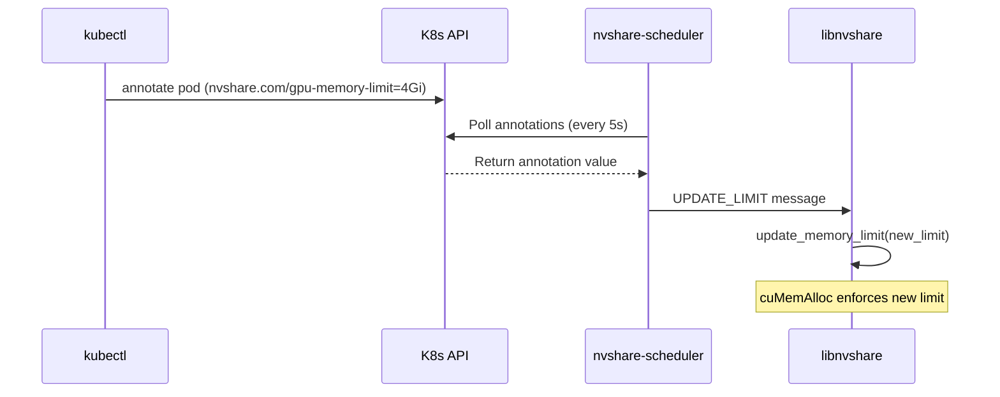

# Dynamic GPU Memory Limit via Annotations - Walkthrough

## Summary
Implemented dynamic GPU memory limit adjustment using Kubernetes Pod annotations. Clients can now have their memory limits updated at runtime without Pod restart via `kubectl annotate`.

## Changes Made

### Protocol Extension
| File | Change |
|------|--------|
| [comm.h](file:///Users/luogangyi/Code/nvshare/src/comm.h) | Added `UPDATE_LIMIT=13` to `message_type` enum and `memory_limit` field to `message` struct |
| [comm.c](file:///Users/luogangyi/Code/nvshare/src/comm.c) | Added `UPDATE_LIMIT` string to message type array |

### Client Handling
| File | Change |
|------|--------|
| [hook.c](file:///Users/luogangyi/Code/nvshare/src/hook.c) | Added `limit_mutex` and thread-safe `update_memory_limit()` function |
| [client.c](file:///Users/luogangyi/Code/nvshare/src/client.c) | Added `UPDATE_LIMIT` case handler calling `update_memory_limit()` |

### K8s API Integration
| File | Change |
|------|--------|
| [k8s_api.h](file:///Users/luogangyi/Code/nvshare/src/k8s_api.h) | **NEW** - Header for K8s API helper functions |
| [k8s_api.c](file:///Users/luogangyi/Code/nvshare/src/k8s_api.c) | **NEW** - libcurl-based K8s API client for reading Pod annotations |
| [scheduler.c](file:///Users/luogangyi/Code/nvshare/src/scheduler.c) | Added `memory_limit` to client struct, `annotation_watcher_fn()` thread, `send_update_limit()`, and thread startup in main |

### Build System
| File | Change |
|------|--------|
| [Makefile](file:///Users/luogangyi/Code/nvshare/src/Makefile) | Added `k8s_api.o` to scheduler deps and `-lcurl` to SCHEDULER_LDLIBS |
| [Dockerfile.baseubuntu](file:///Users/luogangyi/Code/nvshare/Dockerfile.baseubuntu) | Added `libcurl4-openssl-dev` |

### Deployment
| File | Change |
|------|--------|
| [scheduler-rbac.yaml](file:///Users/luogangyi/Code/nvshare/kubernetes/manifests/scheduler-rbac.yaml) | **NEW** - ServiceAccount + ClusterRole for Pod read access |
| [scheduler.yaml](file:///Users/luogangyi/Code/nvshare/kubernetes/manifests/scheduler.yaml) | Added `serviceAccountName: nvshare-scheduler` |

## Verification Results

The feature was verified using the `tests/remote-test-dynamic-limit.sh` script, which performs the following steps:
1. Deploys a Pod with no initial memory limit.
2. Annotates the Pod with `nvshare.com/gpu-memory-limit=2Gi`.
3. Updates the annotation to `4Gi`.
4. Removes the annotation.

Scheduler logs confirm the correct behavior:

```
[NVSHARE][INFO]: Client registered: ...
[NVSHARE][INFO]: Memory limit changed for pod default/dynamic-limit-test: 0 -> 2147483648 bytes
[NVSHARE][INFO]: Sending UPDATE_LIMIT to client 6ccb: 2147483648 bytes (2.00 GiB)
[NVSHARE][INFO]: Memory limit changed for pod default/dynamic-limit-test: 2147483648 -> 4294967296 bytes
[NVSHARE][INFO]: Sending UPDATE_LIMIT to client 6ccb: 4294967296 bytes (4.00 GiB)
[NVSHARE][INFO]: Memory limit changed for pod default/dynamic-limit-test: 4294967296 -> 0 bytes
[NVSHARE][INFO]: Sending UPDATE_LIMIT to client 6ccb: 0 bytes (0.00 GiB)
```

The test confirms that:
- Annotations are correctly detected by the scheduler's watcher thread.
- `UPDATE_LIMIT` messages are correctly dispatched to the client.
- The protocol handles dynamic adjustments without restarting the Pod.

## Usage

### Set Dynamic Limit
```bash
kubectl annotate pod <pod-name> nvshare.com/gpu-memory-limit=2Gi
```

### Update Limit
```bash
kubectl annotate pod <pod-name> nvshare.com/gpu-memory-limit=4Gi --overwrite
```

### Remove Limit
```bash
kubectl annotate pod <pod-name> nvshare.com/gpu-memory-limit-
```

## Architecture

